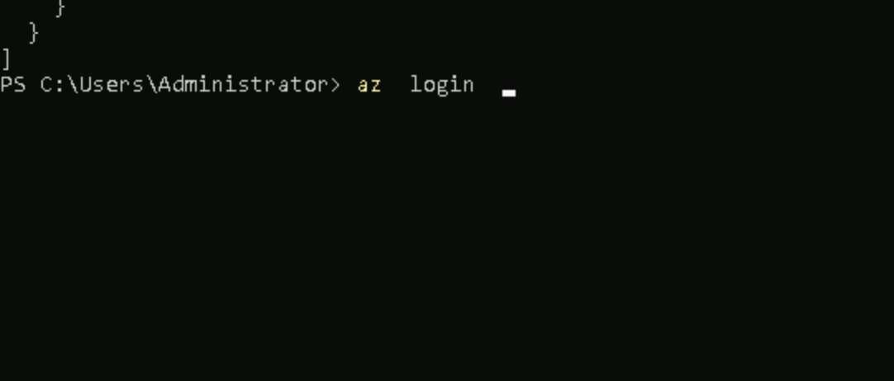

# Eurofins_terraform

### Intro to HCL 

### Terraform to cloud providers

### azure login using az cli

### Terraform code 

### terraform providers

## Terraform lifecycle 

### Init

### Plan -- Dry-run -- preview 

### apply -- to run the code 

### Destroying Resources 

