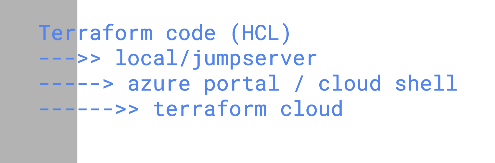
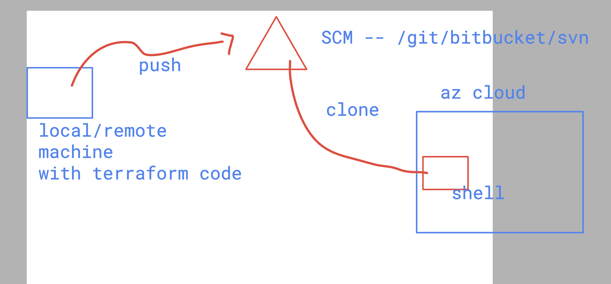
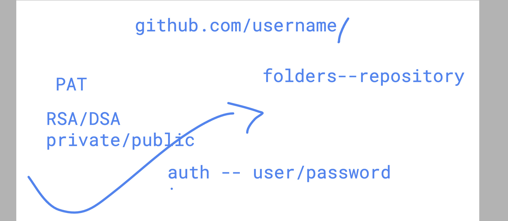
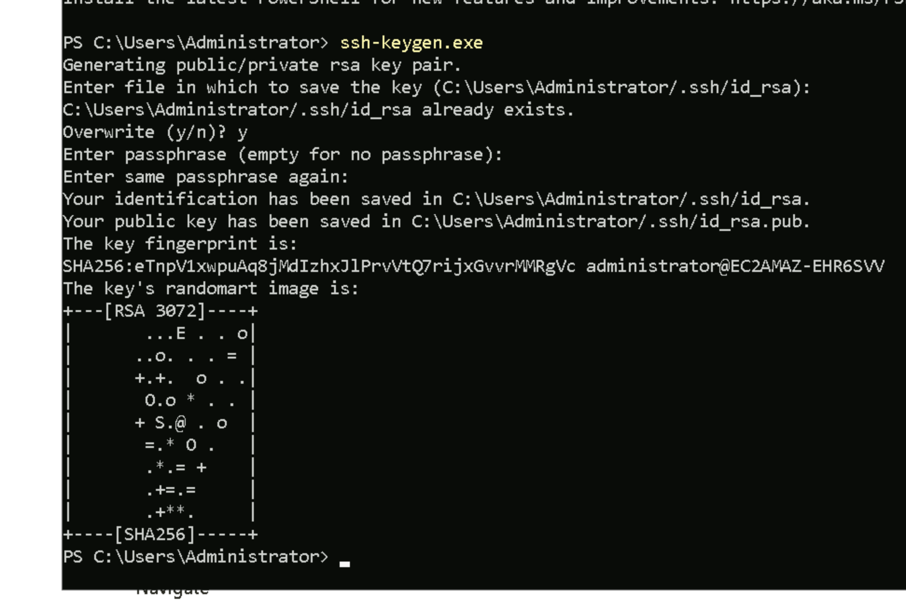
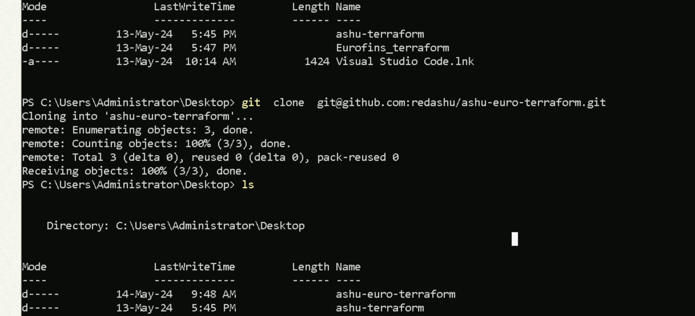
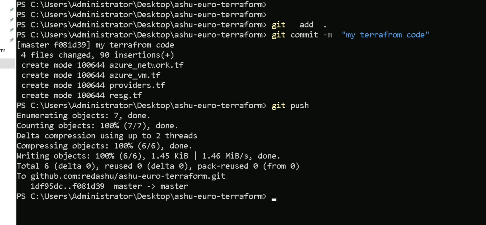
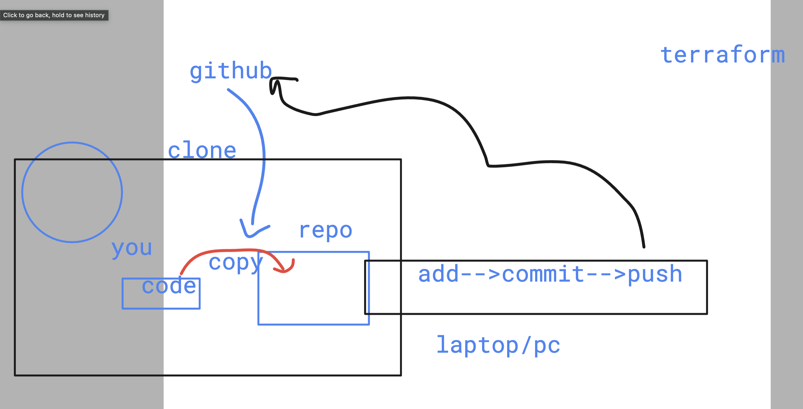

# Eurofins_terraform 

### optiona to run terraform code 

## terraform local to terraform with cloud shell

## github auth 

### creating private and publickeys

### Cloning repo to windows machine 

### pushing code to github account 

### github process

