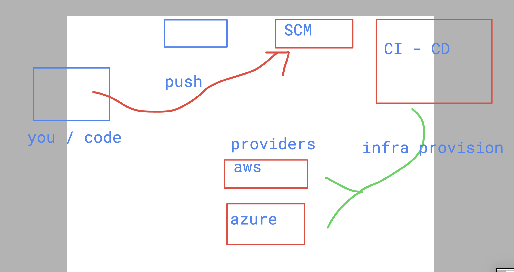
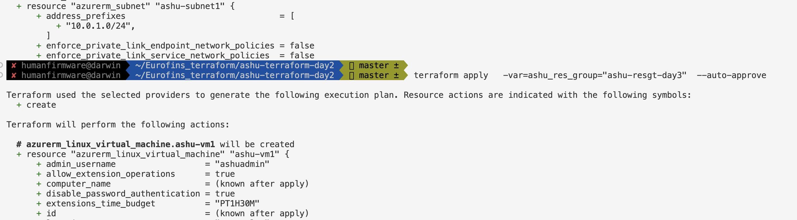
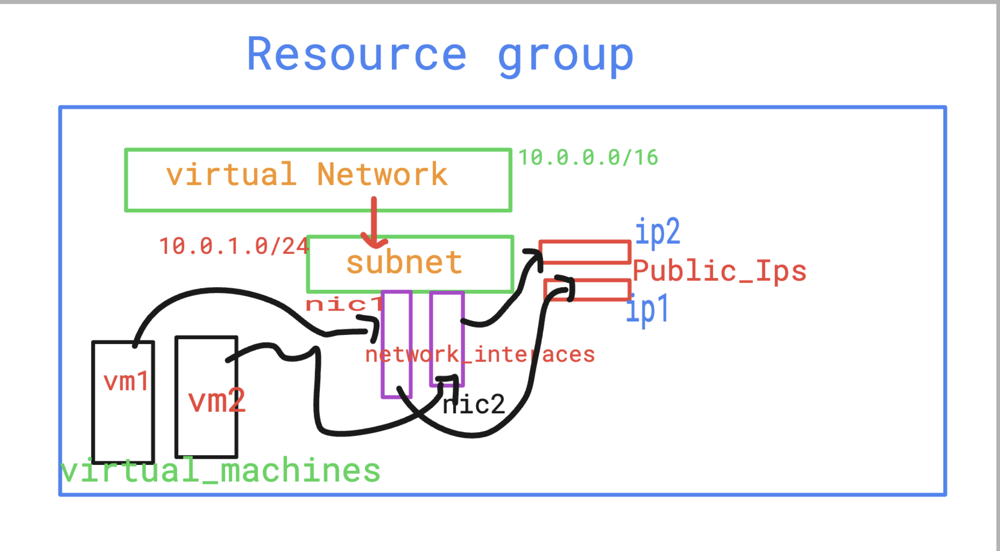
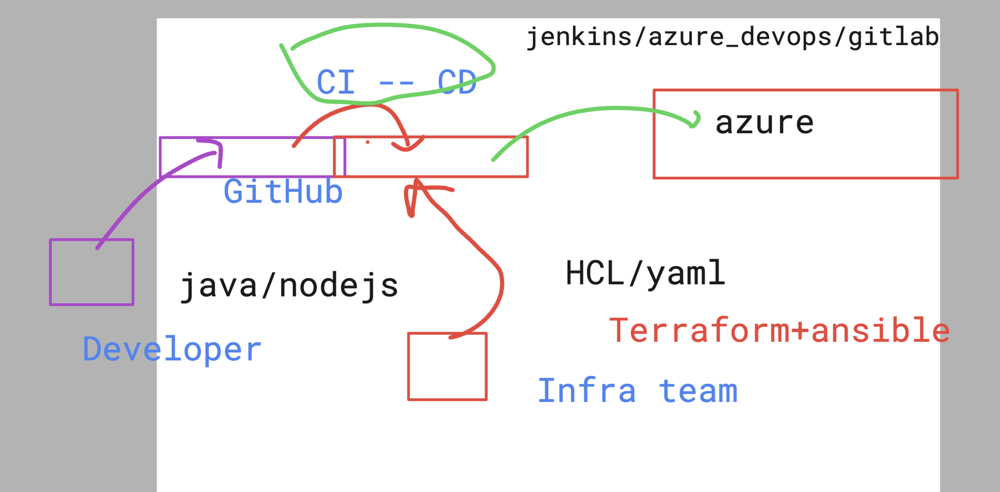
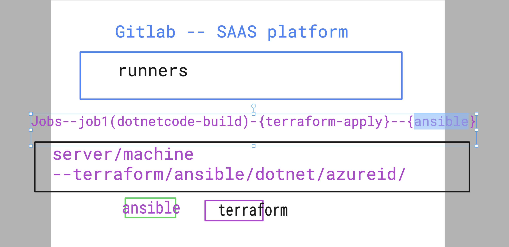
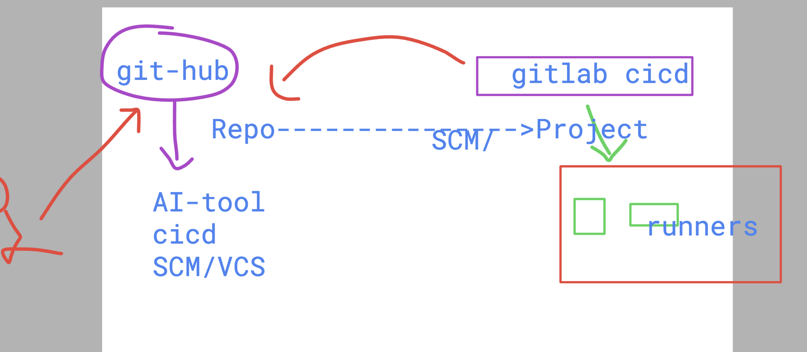
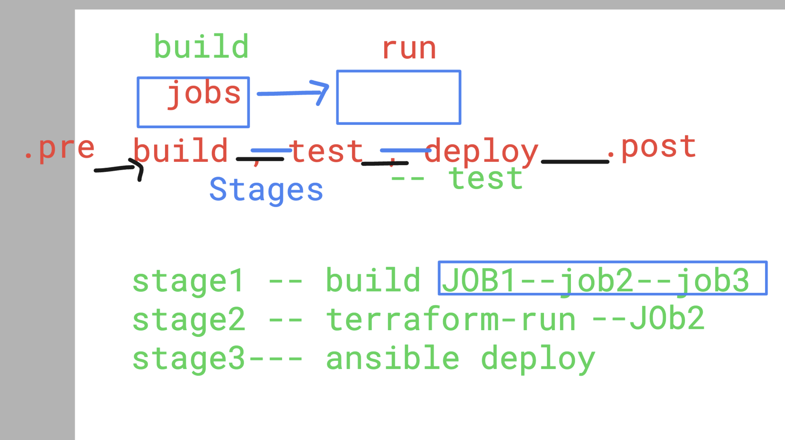

# Eurofins_terraform

### Terraform with CI-tools 

### supply var while plan / apply 

## loop in terraform 

## understanding creating infra 

## Intro to CICD process and tools 

### Gitlab concepts

## github Repo vs  gitlab project 

## concept to stages in gitlab 

