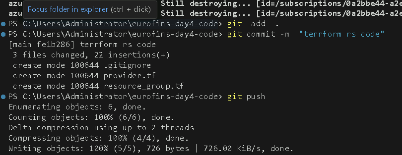
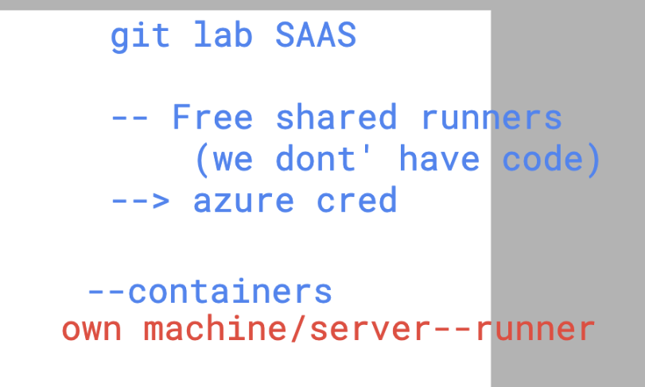
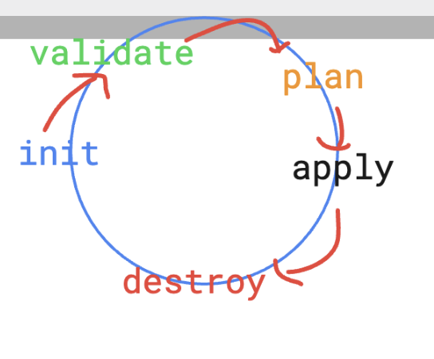
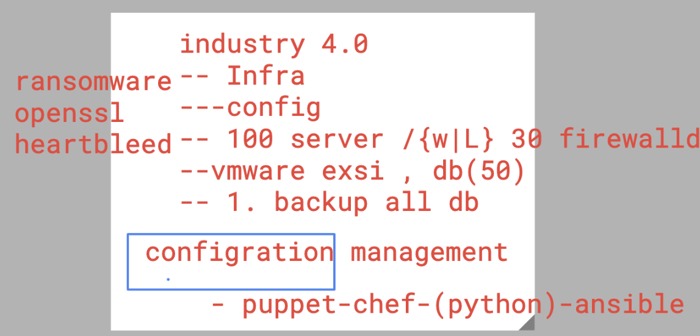
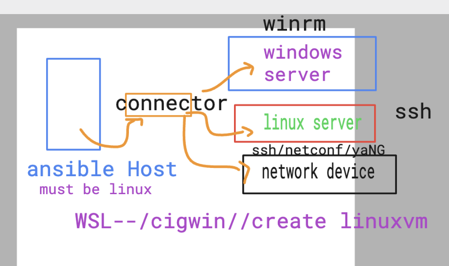
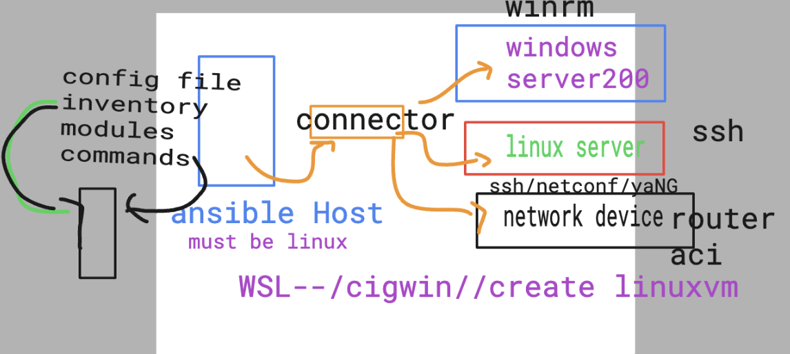
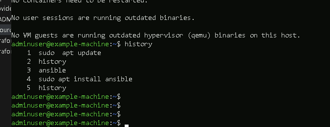
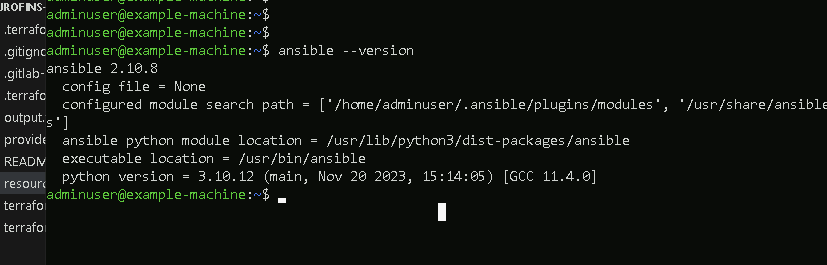
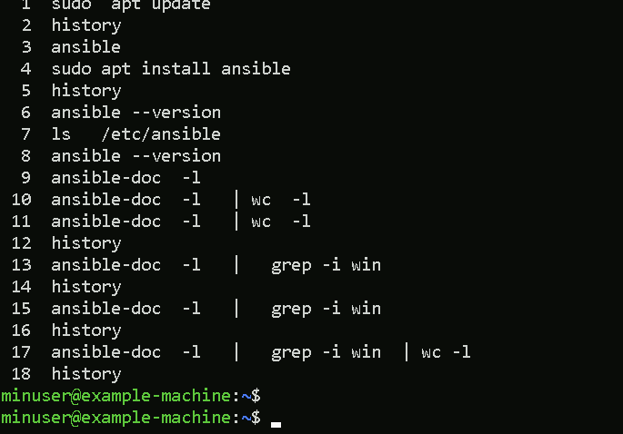

# Eurofins_terraform

### pushing code to gitlab using .gitignore 

## Custom runners

### terraform validate 

## Intro to Ansible -- 

### ansible arch 1 

### ansible host components

### Installing ansible in ubuntu machine 

### checking ansible version 

### ansible commands

